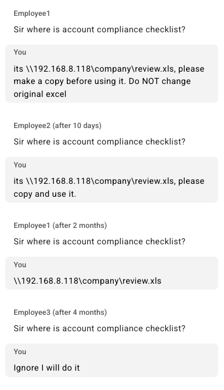
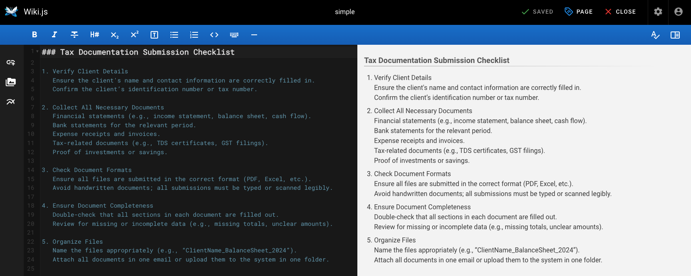
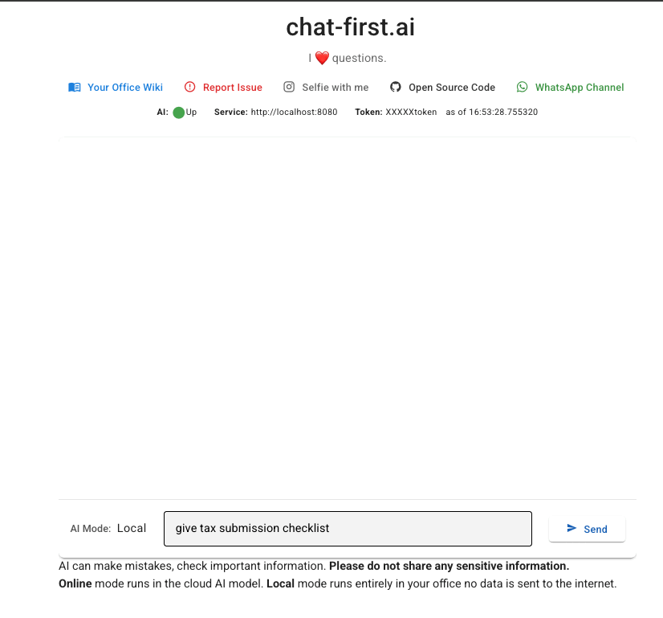
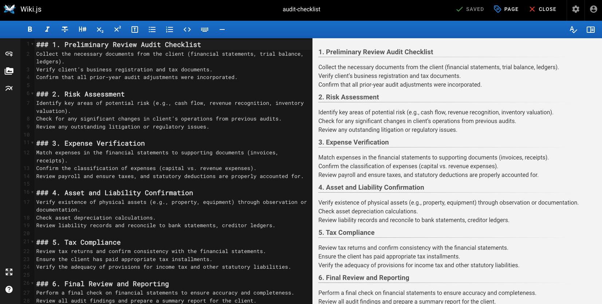
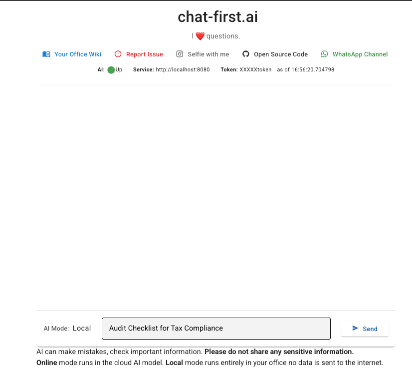

# chat-first.ai

### Some screenshot of wiki with question and answers
**Please Note: Currently, Wiki only support headline 3 (###) section with no special markdown characters in the content**

This app tries to solve common conversation problem like this in the small offices

1. Wiki example 1

   

2. Chat example 1

   

3. Wiki example 2
   
   

4. Chat example 2

   

